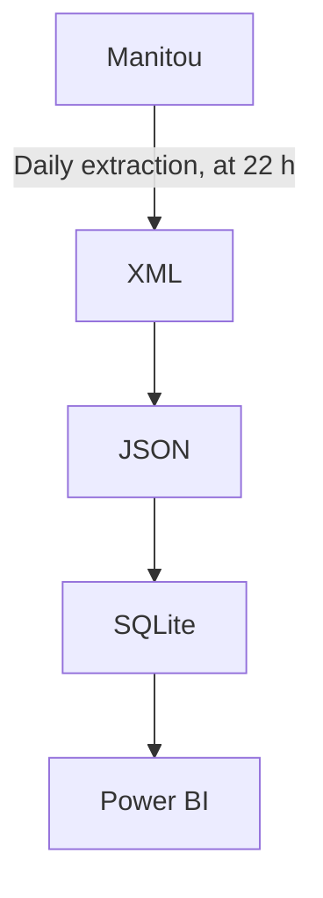

# Manitou Data Converter

This solution:
1. Expects [XML](https://en.wikipedia.org/wiki/XML) files (i.e., data/input/*.xml), manually extracted from the [Manitou](https://manitousolution.com/application) application (i.e., Log In &rarr; General &rarr; Export data (beta));
2. Reads the said files;
3. Converts them to the [JSON](https://en.wikipedia.org/wiki/JSON) data format;
4. Inserts this data into a local [SQLite](https://en.wikipedia.org/wiki/SQLite) database file (i.e., data/output/db.sqlite), as [NoSQL](https://en.wikipedia.org/wiki/NoSQL) documents;
5. Which can then be used by solutions such as [Power BI](https://en.wikipedia.org/wiki/Microsoft_Power_BI).

Note: This solution was developed taking into account the absence of a web API for the Manitou application as well as the fact that it is easier to use data from a database than a batch of XML files.

## Flowchart

## About Manitou
- Application: [Manitou](https://manitousolution.com/application)
- Developer: [Manitou Solution](https://manitousolution.com)
- Address: [412-825, Lebourgneuf Boulevard, Quebec, QC, G2J 0B9](https://www.google.com/maps/place/825+Bd+Lebourgneuf+bureau+412,+Qu%C3%A9bec,+QC+G2J+0B9)
- Technologies: [APEX](https://en.wikipedia.org/wiki/Oracle_Application_Express), [JS](https://en.wikipedia.org/wiki/JavaScript), [PHP](https://en.wikipedia.org/wiki/PHP), [WordPress](https://en.wikipedia.org/wiki/WordPress)
- Web server: [Nginx](https://en.wikipedia.org/wiki/Nginx)
- Web API: [Oracle REST Data Services](https://manitousolution.com/gest)

## About this solution
© Simon Charest | [Forensik](https://forensik.ca/) | [In Fidem](https://infidem.biz/) | [Atos](https://atos.net/). All rights reserved.

## About the author
Mr. Simon Charest, Software Developer and CEO at SLCIT Inc.
- [Email](mailto:simoncharest@gmail.com)
- [GitHub](https://github.com/Simon-Charest)
- [LinkedIn](https://www.linkedin.com/in/simoncharest/)
