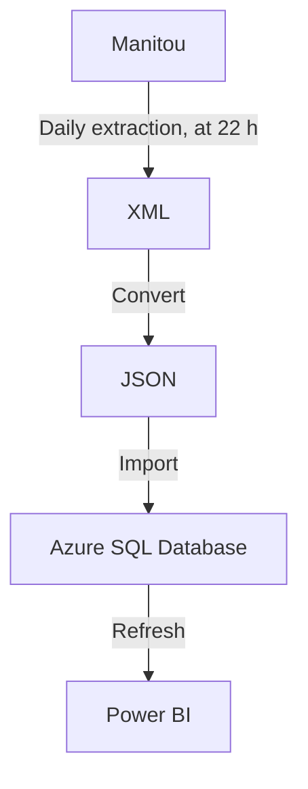

# Manitou Data Converter

## Introduction
This solution was developed taking into account the absence of a web API for the Manitou application as well as the fact that it is easier to use data from a database than a batch of XML files.

This solution:
1. Expects [XML](https://en.wikipedia.org/wiki/XML) files (i.e., data/input/*.xml), manually extracted from the [Manitou](https://manitousolution.com/application) application (i.e., Log In &rarr; General &rarr; Export data (beta));
2. Reads the said files;
3. Converts them to the [JSON](https://en.wikipedia.org/wiki/JSON) data format;
4. Imports the data to [Azure SQL Database](https://en.wikipedia.org/wiki/Microsoft_Azure_SQL_Database);
5. Which can then be used by solutions such as [Power BI](https://en.wikipedia.org/wiki/Microsoft_Power_BI).

To do:
- Manitou should include access to live data and its statistics, through to a web API, with secure authentication (i.e., OAuth 2.0);
- Manitou data should be segregated (i.e. one database per customer) and fully accessible by its owner, in order to comply with the [Act to modernize legislative provisions as regards the protection of personal information](http://assnat.qc.ca/en/travaux-parlementaires/projets-loi/projet-loi-64-42-1.html), which will come into force on 2023-09-22, in the province of Quebec;
- Manitou data should be segregated so that a superuser account is not required to export basic information;
- Manitou should include a reporting module (i.e., Power BI);
- Manitou data export module must be automatic, recurring and its data must be live (i.e., based on a replication of the production database, via a queuing mechanism).

## Flowchart


---

## Install this solution
1. Download and extract the project from [GitHub](https://github.com/Simon-Charest/manitou) (e.g., Code &rarr; Download ZIP &rarr; go to This PC &rarr; Downloads &rarr; select file &rarr; context menu &rarr; Extract All... to `C:\temp\manitou`);
2. Run Windows PowerShell as an administrator;
3. Execute: `& "C:\temp\manitou\install.ps1"`;
4. Copy `"conf/sql_template.json"` to `"conf/sql.json"` and contact your system administrator for assistance in completing the Azure SQL Database configuration.

## Export data from Manitou
1. Log in to [Manitou](https://manitousolution.com/application), with a superuser account;
2. Go to General &rarr; Functions &rarr; Export data (beta);
3. Click + Add, select a Start of extraction (i.e., 2022 January), enter a Number of periods to export (i.e., 6 (months, including the selected Start of extraction)) and select a Requestor (i.e., yourself);
4. Wait after 22 h that night for the query to run;
5. Click on the corresponding Consult button (paperclip icon) to download the archive;
6. Right-click the archive &rarr; Extract All... &rarr; Select a destination folder (i.e., `C:\temp\manitou\data\input`) &rarr; Extract;

## Convert and import data using this solution
1. Run Windows PowerShell;
2. Execute `python "mdc.py" --input "data/input/*.xml" --output "data/output" --convert --sql --verbose`.

Execution example:
```powershell
[2022-08-09 13:21:22] Deleted 15 JSON files in data/output.
[2022-08-09 13:21:22] Found 35 XML files in data/input.
[2022-08-09 13:21:22] Wrote 235 documents to data/output/absences.json.
[2022-08-09 13:21:22] Wrote 189 documents to data/output/absences.json.
[2022-08-09 13:21:22] Wrote 1997 documents to data/output/projectActivities.json.
[2022-08-09 13:21:23] Wrote 4392 documents to data/output/projectActivities.json.
[2022-08-09 13:21:23] Wrote 7215 documents to data/output/timeMoneyAdjustments.json.
[2022-08-09 13:21:25] Wrote 41472 documents to data/output/timeMoneyAdjustments.json.
[2022-08-09 13:21:25] Wrote 391 documents to data/output/projectAssignments.json.
[2022-08-09 13:21:26] Wrote 9423 documents to data/output/projectAssignments.json.
[2022-08-09 13:21:26] Wrote 476 documents to data/output/projectDeliverables.json.
[2022-08-09 13:21:26] Wrote 953 documents to data/output/projectDeliverables.json.
[2022-08-09 13:21:26] Wrote 2897 documents to data/output/CRMAccounts.json.
[2022-08-09 13:21:26] Wrote 3362 documents to data/output/CRMAccounts.json.
[2022-08-09 13:21:27] Wrote 115 documents to data/output/employees.json.
[2022-08-09 13:21:27] Wrote 215 documents to data/output/employees.json.
[2022-08-09 13:21:27] Wrote 215 documents to data/output/employeeSalaries.json.
[2022-08-09 13:21:27] Wrote 425 documents to data/output/employeeSalaries.json.
[2022-08-09 13:21:27] Wrote 11 documents to data/output/projects.json.
[2022-08-09 13:21:27] Wrote 571 documents to data/output/projects.json.
[2022-08-09 13:21:27] Wrote 1015 documents to data/output/projects.json.
[2022-08-09 13:21:27] Wrote 0 documents to data/output/projectContracts.json.
[2022-08-09 13:21:27] Wrote 657 documents to data/output/projectContracts.json.
[2022-08-09 13:21:27] Wrote 1236 documents to data/output/projectContracts.json.
[2022-08-09 13:21:27] Wrote 84 documents to data/output/billedIncomes.json.
[2022-08-09 13:21:27] Wrote 133 documents to data/output/billedIncomes.json.
[2022-08-09 13:21:27] Wrote 481 documents to data/output/summaryDayAssignments.json.
[2022-08-09 13:21:28] Wrote 4842 documents to data/output/summaryDayAssignments.json.
[2022-08-09 13:21:28] Wrote 2855 documents to data/output/summaryDayEmployees.json.
[2022-08-09 13:21:29] Wrote 4396 documents to data/output/summaryDayEmployees.json.
[2022-08-09 13:21:29] Wrote 117 documents to data/output/subcontractors.json.
[2022-08-09 13:21:29] Wrote 129 documents to data/output/subcontractors.json.
[2022-08-09 13:21:29] Wrote 191 documents to data/output/subcontractors.json.
[2022-08-09 13:21:29] Wrote 225 documents to data/output/billedIncomes.json.
[2022-08-09 13:21:29] Wrote 238 documents to data/output/billedIncomes.json.
[2022-08-09 13:21:29] Wrote 13 documents to data/output/activitiesTransfer.json.
[2022-08-09 13:21:29] Wrote 653 documents to data/output/activitiesTransfer.json.
[2022-08-09 13:21:30] Importing JSON data to 15 tables in Azure SQL Database...
[2022-08-09 13:21:30] Dropped 3 tables.
[2022-08-09 13:21:40] Imported 424 documents to absences.
[2022-08-09 13:21:56] Imported 666 documents to activitiesTransfer.
[2022-08-09 13:22:15] Imported 680 documents to billedIncomes.
[2022-08-09 13:24:50] Imported 6259 documents to CRMAccounts.
[2022-08-09 13:24:59] Imported 330 documents to employees.
[2022-08-09 13:25:14] Imported 640 documents to employeeSalaries.
[2022-08-09 13:27:50] Imported 6389 documents to projectActivities.
[2022-08-09 13:31:50] Imported 9814 documents to projectAssignments.
[2022-08-09 13:32:35] Imported 1893 documents to projectContracts.
[2022-08-09 13:33:10] Imported 1429 documents to projectDeliverables.
[2022-08-09 13:33:51] Imported 1597 documents to projects.
[2022-08-09 13:34:03] Imported 437 documents to subcontractors.
[2022-08-09 13:36:17] Imported 5323 documents to summaryDayAssignments.
[2022-08-09 13:39:19] Imported 7251 documents to summaryDayEmployees.
[2022-08-09 13:59:16] Imported 48687 documents to timeMoneyAdjustments.
[2022-08-09 13:59:16] Creating columns and indexes...
[2022-08-09 13:59:16] Created index_absences_absenceId on absences.absenceId.
[2022-08-09 13:59:16] Created index_absences_absenceRequestId on absences.absenceRequestId.
[2022-08-09 13:59:16] Created index_absences_employeeId on absences.employeeId.
[2022-08-09 13:59:16] Created index_activitiesTransfer_employeeId on activitiesTransfer.employeeId.
[2022-08-09 13:59:16] Created index_activitiesTransfer_fromActivityId on activitiesTransfer.fromActivityId.
[2022-08-09 13:59:16] Created index_activitiesTransfer_fromAssignmentId on activitiesTransfer.fromAssignmentId.
[2022-08-09 13:59:17] Created index_activitiesTransfer_toActivityId on activitiesTransfer.toActivityId.
[2022-08-09 13:59:17] Created index_activitiesTransfer_toAssignmentId on activitiesTransfer.toAssignmentId.
[2022-08-09 13:59:17] Created index_billedIncomes_contractId on billedIncomes.contractId.
[2022-08-09 13:59:17] Created index_billedIncomes_projectId on billedIncomes.projectId.
[2022-08-09 13:59:17] Created index_billedIncomes_WiPABemployeeId on billedIncomes.WiPABemployeeId.
[2022-08-09 13:59:18] Created index_CRMAccounts_accountId on CRMAccounts.accountId.
[2022-08-09 13:59:18] Created index_CRMAccounts_responsibleEmployeeId on CRMAccounts.responsibleEmployeeId.
[2022-08-09 13:59:18] Created index_CRMAccounts_accountId on CRMAccounts.accountId.
[2022-08-09 13:59:18] Created index_employees_employeeId on employees.employeeId.
[2022-08-09 13:59:18] Created index_employees_managerEmployeeId on employees.managerEmployeeId.
[2022-08-09 13:59:19] Created index_employeeSalaries_employeeId on employeeSalaries.employeeId.
[2022-08-09 13:59:20] Created index_projectActivities_activityId on projectActivities.activityId.
[2022-08-09 13:59:20] Created index_projectActivities_deliverableId on projectActivities.deliverableId.
[2022-08-09 13:59:21] Created index_projectActivities_projectId on projectActivities.projectId.
[2022-08-09 13:59:24] Created index_projectAssignments_activityId on projectAssignments.activityId.
[2022-08-09 13:59:27] Created index_projectAssignments_assignmentId on projectAssignments.assignmentId.
[2022-08-09 13:59:28] Created index_projectAssignments_employeeId on projectAssignments.employeeId.
[2022-08-09 13:59:28] Created index_projectAssignments_projectId on projectAssignments.projectId.
[2022-08-09 13:59:28] Created index_projectContracts_accountId on projectContracts.accountId.
[2022-08-09 13:59:29] Created index_projectContracts_contractId on projectContracts.contractId.
[2022-08-09 13:59:29] Created index_projectContracts_projectId on projectContracts.projectId.
[2022-08-09 13:59:29] Created index_projectDeliverables_contractId on projectDeliverables.contractId.
[2022-08-09 13:59:29] Created index_projectDeliverables_deliverableId on projectDeliverables.deliverableId.
[2022-08-09 13:59:29] Created index_projectDeliverables_projectId on projectDeliverables.projectId.
[2022-08-09 13:59:29] Created index_projectDeliverables_responsibleEmployeeId on projectDeliverables.responsibleEmployeeId.
[2022-08-09 13:59:29] Created index_projects_endAccountId on projects.endAccountId.
[2022-08-09 13:59:29] Created index_projects_invoicingResponsibleEmployeeId on projects.invoicingResponsibleEmployeeId.
[2022-08-09 13:59:29] Created index_projects_projectAccountId on projects.projectAccountId.
[2022-08-09 13:59:30] Created index_projects_projectId on projects.projectId.
[2022-08-09 13:59:30] Created index_projects_projectManagerEmployeeId on projects.projectManagerEmployeeId.
[2022-08-09 13:59:30] Created index_projects_projectResponsibleEmployeeId on projects.projectResponsibleEmployeeId.
[2022-08-09 13:59:30] Created index_subcontractors_employeeId on subcontractors.employeeId.
[2022-08-09 13:59:30] Created index_subcontractors_managerEmployeeId on subcontractors.managerEmployeeId.
[2022-08-09 13:59:30] Created index_subcontractors_employeeId on subcontractors.employeeId.
[2022-08-09 13:59:30] Created index_summaryDayAssignments_activityId on summaryDayAssignments.activityId.
[2022-08-09 13:59:31] Created index_summaryDayAssignments_employeeId on summaryDayAssignments.employeeId.
[2022-08-09 13:59:31] Created index_summaryDayAssignments_projectId on summaryDayAssignments.projectId.
[2022-08-09 13:59:32] Created index_summaryDayEmployees_employeeId on summaryDayEmployees.employeeId.
[2022-08-09 13:59:37] Created index_timeMoneyAdjustments_activityId on timeMoneyAdjustments.activityId.
[2022-08-09 13:59:42] Created index_timeMoneyAdjustments_employeeId on timeMoneyAdjustments.employeeId.
[2022-08-09 13:59:42] ** DONE **
```

For help, use: `python "mdc.py" --help`.
```powershell
usage: mdc.py [-h] [--input INPUT] [--output OUTPUT] [--encoding ENCODING] [--ensure_ascii] [--indent INDENT] [--mode MODE]
              [--convert] [--sql] [--verbose] [--test]

options:
  -h, --help           show this help message and exit
  --input INPUT        Input pathname (default: data/input/*.xml)
  --output OUTPUT      Output directory (default: data/output)
  --encoding ENCODING  File encoding (default: utf-8)
  --ensure_ascii       Ensure ASCII encoding (default: False)
  --indent INDENT      Indentation (default: \t)
  --mode MODE          File mode (default: w)
  --convert            Convert data from XML to JSON (default: False)
  --sql                Import JSON data to Azure SQL database (default: False)
  --verbose            Verbose (default: False)
  --test               Skip import process (default: False)
```

The data will be imported, as JSON, into the "value" field, of the following tables, in a database named "manitoudb", in an Azure SQL Database instance.
- absences;
- activitiesTransfer;
- billedIncomes;
- CRMAccounts;
- employees;
- employeeSalaries;
- projectActivities;
- projectAssignments;
- projectContracts;
- projectDeliverables;
- projects;
- subcontractors;
- summaryDayAssignments;
- summaryDayEmployees;
- timeMoneyAdjustments.

Here are examples of queries allowing the exploitation of data, in [SQL Server Management Studio](https://docs.microsoft.com/en-us/sql/ssms/download-sql-server-management-studio-ssms):
```sql
-- Employees
SELECT DISTINCT JSON_VALUE(e.value, '$.employeeId') AS employeeId
  , JSON_VALUE(e.value, '$.statusEN') AS statusEN
  , JSON_VALUE(e.value, '$.name') AS name
  , JSON_VALUE(e.value, '$.firstName') AS firstName
  , JSON_VALUE(e.value, '$.sexEN') AS sexEN
  , JSON_VALUE(e.value, '$.languageEN') AS languageEN
  , JSON_VALUE(e.value, '$.email') AS email
  , JSON_VALUE(e.value, '$.countryOfOriginEN') AS countryOfOriginEN
  , JSON_VALUE(e.value, '$.birthDate') AS birthDate
  , JSON_VALUE(e.value, '$.hireDate') AS hireDate
  , JSON_VALUE(e.value, '$.employementEndDate') AS employementEndDate
  , JSON_VALUE(e.value, '$.workplaceEN') AS workplaceEN
  , JSON_VALUE(e.value, '$.positions.position.positionEN') AS positionEN
FROM employees AS e
WHERE JSON_VALUE(e.value, '$.statusEN') = 'Active'
  AND JSON_VALUE(e.value, '$.employementEndDate') IS NULL
  AND JSON_VALUE(e.value, '$.email') LIKE '%@forensik.ca'
ORDER BY name ASC
  , firstName ASC
;
```

```sql
-- Projects
SELECT DISTINCT JSON_VALUE(p.value, '$.projectId') AS projectId
  , JSON_VALUE(p.value, '$.projectTitle') AS projectTitle
  , JSON_VALUE(p.value, '$.startDate') AS startDate
  , JSON_VALUE(p.value, '$.expectedEndDate') AS expectedEndDate
  , JSON_VALUE(p.value, '$.endDate') AS endDate
  , JSON_VALUE(p.value, '$.statusEN') AS statusEN
  , JSON_VALUE(e.value, '$.name') AS name
  , JSON_VALUE(e.value, '$.firstName') AS firstName
  , JSON_VALUE(e.value, '$.email') AS email
FROM projects AS p
  LEFT JOIN employees AS e ON JSON_VALUE(e.value, '$.employeeId') = JSON_VALUE(p.value, '$.projectManagerEmployeeId')
WHERE JSON_VALUE(p.value, '$.endDate') IS NULL
  AND JSON_VALUE(p.value, '$.projectTitle') NOT LIKE 'Projet interne%'
ORDER BY JSON_VALUE(p.value, '$.startDate') ASC
  , JSON_VALUE(p.value, '$.expectedEndDate') ASC
  , JSON_VALUE(p.value, '$.projectTitle') ASC
;
```

## Import data into Power BI
### Create new report
1. Install [Power BI](https://powerbi.microsoft.com/en-us/downloads/);
2. Run Power BI.

### Get data from JSON data files
3. File &rarr; Get Data &rarr; Get data to get started &rarr; JSON &rarr; Connect;
4. Select the first file &rarr; Open;
5. Home &rarr; New Source &rarr; JSON &rarr; JSON;
6. Select next file &rarr; Open;
7. Repeat steps 5 and 6 for each file.

### Save Power BI file
9. Close & Apply;
10. File &rarr; Save &rarr; File name: `"C:\temp\manitou\data\manitou.pbix"`.

## Refresh reports
1. Repeat export and convert steps;
2. Refresh data in Power BI, using Home &rarr; Refresh;
3. Save Power BI file, using File &rarr; Save.

---

## About Manitou
- Application: [Manitou](https://manitousolution.com/application);
- Developer: [Manitou Solution](https://manitousolution.com);
- Address: [412-825, Lebourgneuf Boulevard, Quebec, QC, G2J 0B9](https://www.google.com/maps/place/825+Bd+Lebourgneuf+bureau+412,+Qu%C3%A9bec,+QC+G2J+0B9);
- Technologies: [APEX](https://en.wikipedia.org/wiki/Oracle_Application_Express), [JS](https://en.wikipedia.org/wiki/JavaScript), [PHP](https://en.wikipedia.org/wiki/PHP), [WordPress](https://en.wikipedia.org/wiki/WordPress);
- Web server: [Nginx](https://en.wikipedia.org/wiki/Nginx);
- Web API: [Oracle REST Data Services (ORDS)](https://en.wikipedia.org/wiki/Oracle_Application_Express#APEX_Service).

## Related solutions
- [Dynamics 365](https://dynamics.microsoft.com/);
- [JIRA](https://www.atlassian.com/software/jira);
- [Nethris](https://nethris.com/);
- [Sage](https://www.sage.com/).

## About this solution
© Simon Charest | [Forensik](https://forensik.ca/) | [In Fidem](https://infidem.biz/) | [Atos](https://atos.net/). All rights reserved.

## Requirements
- [Azure SQL Database](https://en.wikipedia.org/wiki/Microsoft_Azure_SQL_Database);
- [Git](https://git-scm.com/) (optional);
- [GitHub](https://github.com/) (optional);
- [Manitou](https://manitousolution.com/application/);
- [SQL Server Management Studio](https://docs.microsoft.com/en-us/sql/ssms/download-sql-server-management-studio-ssms) (optional);
- [Power BI](https://en.wikipedia.org/wiki/Microsoft_Power_BI) (optional);
- [PowerShell](https://en.wikipedia.org/wiki/PowerShell);
- [PyCharm](https://www.jetbrains.com/pycharm/) (optional);
- [Python](https://www.python.org/);
  - [colorama](https://pypi.org/project/colorama/);
  - [pip](https://pypi.org/project/pip/);
  - [pyodbc](https://pypi.org/project/pyodbc/);
  - [Python O365](https://github.com/O365/python-o365);
  - [setuptools](https://pypi.org/project/setuptools/);
  - [xmltodict](https://pypi.org/project/xmltodict/).

## About the author
Mr. Simon Charest, Software Developer and CEO at SLCIT Inc.
- [Email](mailto:simoncharest@gmail.com);
- [GitHub](https://github.com/Simon-Charest);
- [LinkedIn](https://www.linkedin.com/in/simoncharest/).
