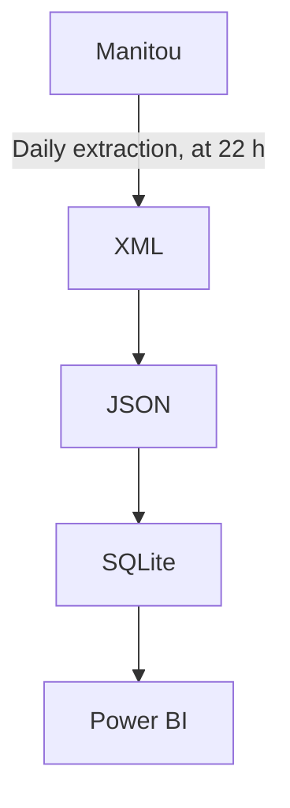

# Manitou Data Converter

## Introduction
This solution was developed taking into account the absence of a web API for the Manitou application as well as the fact that it is easier to use data from a database than a batch of XML files.

This solution:
1. Expects [XML](https://en.wikipedia.org/wiki/XML) files (i.e., data/input/*.xml), manually extracted from the [Manitou](https://manitousolution.com/application) application (i.e., Log In &rarr; General &rarr; Export data (beta));
2. Reads the said files;
3. Converts them to the [JSON](https://en.wikipedia.org/wiki/JSON) data format;
4. Inserts this data into a local [SQLite](https://en.wikipedia.org/wiki/SQLite) database file (i.e., data/output/db.sqlite), as [NoSQL](https://en.wikipedia.org/wiki/NoSQL) documents;
5. Which can then be used by solutions such as [Power BI](https://en.wikipedia.org/wiki/Microsoft_Power_BI).

To do:
- The solution should include a web API access to live data with secure authentication (i.e., OAuth 2.0);
- The solution data should be segregated (i.e. one database per customer) and fully accessible by its owner, in order to comply with the [Act to modernize legislative provisions as regards the protection of personal information](http://assnat.qc.ca/en/travaux-parlementaires/projets-loi/projet-loi-64-42-1.html), which will come into force on 2023-09-22, in the province of Quebec;
- The solution should include a reporting module (i.e., Power BI);
- The solution's data export module must be live (i.e., based on a replication of the production database, via a queuing mechanism), recurring and automatic.

## Flowchart

---

## Installation
1. Download and extract the project from [GitHub](https://github.com/Simon-Charest/manitou) (e.g., Code &rarr; Download ZIP &rarr; go to This PC &rarr; Downloads &rarr; select file &rarr; context menu &rarr; Extract All... to `C:\temp\manitou`);
2. Run Windows PowerShell as an administrator;
3. Execute: `& "C:\temp\manitou\install.ps1"`.

## Usage
1. Run Windows PowerShell;
2. Execute `python main.py --input "data/input/*.xml" --output "data/output" --verbose`.

---

## Power BI

### Create new report
1. Install [Power BI](https://powerbi.microsoft.com/en-us/downloads/);
2. Run Power BI;

### A. Get data from JSON data files (recommended)
3. File &rarr; Get Data &rarr; Get data to get started &rarr; JSON &rarr; Connect;
4. Select the first file &rarr; Open;
5. Home &rarr; New Source &rarr; JSON &rarr; JSON;
6. Select next file &rarr; Open;
7. Repeat steps 5 and 6 for each file;

### B. Get data from a SQLite database file
3. Install [SQLite ODBC Driver](http://www.ch-werner.de/sqliteodbc/) (for Win64);
4. File &rarr; Get Data &rarr; Get data to get started &rarr; ODBC &rarr; Connect;
5. Data source name (DSN): SQLite3 Datasource;
6. Connection string (non-credential properties): `Database=C:\temp\manitou\db.sqlite`;
7. Check all tables &rarr; Load;
8. Select each table &rarr; Transform &rarr; Parse &rarr; JSON &rarr; Record;

### Save Power BI file
9. Close & Apply;
10. File &rarr; Save &rarr; File name: `"C:\src\Forensik\manitou\data\manitou.pbix"`.

---

## About Manitou
- Application: [Manitou](https://manitousolution.com/application);
- Developer: [Manitou Solution](https://manitousolution.com);
- Address: [412-825, Lebourgneuf Boulevard, Quebec, QC, G2J 0B9](https://www.google.com/maps/place/825+Bd+Lebourgneuf+bureau+412,+Qu%C3%A9bec,+QC+G2J+0B9);
- Technologies: [APEX](https://en.wikipedia.org/wiki/Oracle_Application_Express), [JS](https://en.wikipedia.org/wiki/JavaScript), [PHP](https://en.wikipedia.org/wiki/PHP), [WordPress](https://en.wikipedia.org/wiki/WordPress);
- Web server: [Nginx](https://en.wikipedia.org/wiki/Nginx);
- Web API: [Oracle REST Data Services (ORDS)](https://en.wikipedia.org/wiki/Oracle_Application_Express#APEX_Service).

## Related solutions
- [Dynamics 365](https://dynamics.microsoft.com/);
- [JIRA](https://www.atlassian.com/software/jira);
- [Nethris](https://nethris.com/);
- [Sage](https://www.sage.com/).

## About this solution
© Simon Charest | [Forensik](https://forensik.ca/) | [In Fidem](https://infidem.biz/) | [Atos](https://atos.net/). All rights reserved.

## About the author
Mr. Simon Charest, Software Developer and CEO at SLCIT Inc.
- [Email](mailto:simoncharest@gmail.com);
- [GitHub](https://github.com/Simon-Charest);
- [LinkedIn](https://www.linkedin.com/in/simoncharest/).
