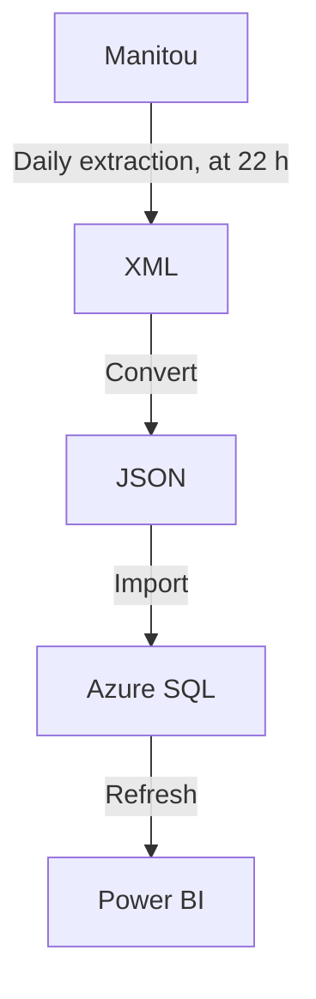

# Manitou Data Converter

## Introduction
This solution was developed taking into account the absence of a web API for the Manitou application as well as the fact that it is easier to use data from a database than a batch of XML files.

This solution:
1. Expects [XML](https://en.wikipedia.org/wiki/XML) files (i.e., data/input/*.xml), manually extracted from the [Manitou](https://manitousolution.com/application) application (i.e., Log In &rarr; General &rarr; Export data (beta));
2. Reads the said files;
3. Converts them to the [JSON](https://en.wikipedia.org/wiki/JSON) data format;
4. Imports the data to [Azure SQL Database](https://en.wikipedia.org/wiki/Microsoft_Azure_SQL_Database);
5. Which can then be used by solutions such as [Power BI](https://en.wikipedia.org/wiki/Microsoft_Power_BI).

To do:
- Manitou should include access to live data and its statistics, through to a web API, with secure authentication (i.e., OAuth 2.0);
- Manitou data should be segregated (i.e. one database per customer) and fully accessible by its owner, in order to comply with the [Act to modernize legislative provisions as regards the protection of personal information](http://assnat.qc.ca/en/travaux-parlementaires/projets-loi/projet-loi-64-42-1.html), which will come into force on 2023-09-22, in the province of Quebec;
- Manitou data should be segregated so that a superuser account is not required to export basic information;
- Manitou should include a reporting module (i.e., Power BI);
- Manitou data export module must be automatic, recurring and its data must be live (i.e., based on a replication of the production database, via a queuing mechanism).

## Flowchart


---

## Install this solution
1. Download and extract the project from [GitHub](https://github.com/Simon-Charest/manitou) (e.g., Code &rarr; Download ZIP &rarr; go to This PC &rarr; Downloads &rarr; select file &rarr; context menu &rarr; Extract All... to `C:\temp\manitou`);
2. Run Windows PowerShell as an administrator;
3. Execute: `& "C:\temp\manitou\install.ps1"`.

## Export data from Manitou
1. Log in to [Manitou](https://manitousolution.com/application), with a superuser account;
2. Go to General &rarr; Functions &rarr; Export data (beta);
3. Click + Add, select a Start of extraction (i.e., 2022 January), enter a Number of periods to export (i.e., 6 (months, including the selected Start of extraction)) and select a Requestor (i.e., yourself);
4. Wait after 22 h that night for the query to run;
5. Click on the corresponding Consult button (paperclip icon) to download the archive;
6. Right-click the archive &rarr; Extract All... &rarr; Select a destination folder (i.e., `C:\temp\manitou\data\input`) &rarr; Extract;

## Convert and import data using this solution
1. Run Windows PowerShell;
2. Execute `python "mdc.py" --input "data/input/*.xml" --output "data/output" --convert --sql --verbose`.

Execution example:
```powershell
Deleted 15 JSON files in data/output.
Found 35 XML files in data/input.
Wrote 235 documents to data/output/absences.json.
Wrote 189 documents to data/output/absences.json.
Wrote 1997 documents to data/output/projectActivities.json.
Wrote 4392 documents to data/output/projectActivities.json.
Wrote 7215 documents to data/output/timeMoneyAdjustments.json.
Wrote 41472 documents to data/output/timeMoneyAdjustments.json.
Wrote 391 documents to data/output/projectAssignments.json.
Wrote 9423 documents to data/output/projectAssignments.json.
Wrote 476 documents to data/output/projectDeliverables.json.
Wrote 953 documents to data/output/projectDeliverables.json.
Wrote 2897 documents to data/output/CRMAccounts.json.
Wrote 3362 documents to data/output/CRMAccounts.json.
Wrote 115 documents to data/output/employees.json.
Wrote 215 documents to data/output/employees.json.
Wrote 215 documents to data/output/employeeSalaries.json.
Wrote 425 documents to data/output/employeeSalaries.json.
Wrote 11 documents to data/output/projects.json.
Wrote 571 documents to data/output/projects.json.
Wrote 1015 documents to data/output/projects.json.
Wrote 0 documents to data/output/projectContracts.json.
Wrote 657 documents to data/output/projectContracts.json.
Wrote 1236 documents to data/output/projectContracts.json.
Wrote 84 documents to data/output/billedIncomes.json.
Wrote 133 documents to data/output/billedIncomes.json.
Wrote 481 documents to data/output/summaryDayAssignments.json.
Wrote 4842 documents to data/output/summaryDayAssignments.json.
Wrote 2855 documents to data/output/summaryDayEmployees.json.
Wrote 4396 documents to data/output/summaryDayEmployees.json.
Wrote 117 documents to data/output/subcontractors.json.
Wrote 129 documents to data/output/subcontractors.json.
Wrote 191 documents to data/output/subcontractors.json.
Wrote 225 documents to data/output/billedIncomes.json.
Wrote 238 documents to data/output/billedIncomes.json.
Wrote 13 documents to data/output/activitiesTransfer.json.
Wrote 653 documents to data/output/activitiesTransfer.json.
Importing JSON data to 15 tables in Azure SQL Database...
Imported 424 documents to absences.
Imported 666 documents to activitiesTransfer.
Imported 680 documents to billedIncomes.
Imported 6259 documents to CRMAccounts.
Imported 330 documents to employees.
Imported 640 documents to employeeSalaries.
Imported 6389 documents to projectActivities.
Imported 9814 documents to projectAssignments.
Imported 1893 documents to projectContracts.
Imported 1429 documents to projectDeliverables.
Imported 1597 documents to projects.
Imported 437 documents to subcontractors.
Imported 5323 documents to summaryDayAssignments.
Imported 7251 documents to summaryDayEmployees.
Imported 48687 documents to timeMoneyAdjustments.
** DONE **
```

For help, use: `python "mdc.py" --help`.
```powershell
usage: mdc.py [-h] [--input INPUT] [--output OUTPUT] [--encoding ENCODING] [--ensure_ascii] [--indent INDENT] [--mode MODE]
              [--convert] [--sql] [--verbose] [--test]

options:
  -h, --help           show this help message and exit
  --input INPUT        Input pathname (default: data/input/*.xml)
  --output OUTPUT      Output directory (default: data/output)
  --encoding ENCODING  File encoding (default: utf-8)
  --ensure_ascii       Ensure ASCII encoding (default: False)
  --indent INDENT      Indentation (default: \t)
  --mode MODE          File mode (default: w)
  --convert            Convert data from XML to JSON (default: False)
  --sql                Import JSON data to Azure SQL database (default: False)
  --verbose            Verbose (default: False)
  --test               Skip import process (default: False)
```

The data will be imported, as JSON, into the "value" field, of the following tables, in a database named "manitoudb", in an Azure SQL Database instance.
- absences;
- activitiesTransfer;
- billedIncomes;
- CRMAccounts;
- employees;
- employeeSalaries;
- projectActivities;
- projectAssignments;
- projectContracts;
- projectDeliverables;
- projects;
- subcontractors;
- summaryDayAssignments;
- summaryDayEmployees;
- timeMoneyAdjustments.

Here is an example of a query allowing you to use the data, in [SQL Server Management Studio](https://docs.microsoft.com/en-us/sql/ssms/download-sql-server-management-studio-ssms):
```sql
SELECT DISTINCT JSON_VALUE(e.value, '$.employeeId') AS employeeId
    , JSON_VALUE(e.value, '$.name') AS name
    , JSON_VALUE(e.value, '$.firstName') AS firstName
    , JSON_VALUE(e.value, '$.hireDate') AS hireDate
    , JSON_VALUE(e.value, '$.employementEndDate') AS employementEndDate
FROM employees AS e
WHERE JSON_VALUE(e.value, '$.employementEndDate') IS NULL
    AND JSON_VALUE(e.value, '$.email') LIKE '%@forensik.ca'
ORDER BY name ASC
    , firstName ASC
;
```

## Import data into Power BI
### Create new report
1. Install [Power BI](https://powerbi.microsoft.com/en-us/downloads/);
2. Run Power BI.

### Get data from JSON data files
3. File &rarr; Get Data &rarr; Get data to get started &rarr; JSON &rarr; Connect;
4. Select the first file &rarr; Open;
5. Home &rarr; New Source &rarr; JSON &rarr; JSON;
6. Select next file &rarr; Open;
7. Repeat steps 5 and 6 for each file.

### Save Power BI file
9. Close & Apply;
10. File &rarr; Save &rarr; File name: `"C:\temp\manitou\data\manitou.pbix"`.

## Refresh reports
1. Repeat export and convert steps;
2. Refresh data in Power BI, using Home &rarr; Refresh;
3. Save Power BI file, using File &rarr; Save.

---

## About Manitou
- Application: [Manitou](https://manitousolution.com/application);
- Developer: [Manitou Solution](https://manitousolution.com);
- Address: [412-825, Lebourgneuf Boulevard, Quebec, QC, G2J 0B9](https://www.google.com/maps/place/825+Bd+Lebourgneuf+bureau+412,+Qu%C3%A9bec,+QC+G2J+0B9);
- Technologies: [APEX](https://en.wikipedia.org/wiki/Oracle_Application_Express), [JS](https://en.wikipedia.org/wiki/JavaScript), [PHP](https://en.wikipedia.org/wiki/PHP), [WordPress](https://en.wikipedia.org/wiki/WordPress);
- Web server: [Nginx](https://en.wikipedia.org/wiki/Nginx);
- Web API: [Oracle REST Data Services (ORDS)](https://en.wikipedia.org/wiki/Oracle_Application_Express#APEX_Service).

## Related solutions
- [Dynamics 365](https://dynamics.microsoft.com/);
- [JIRA](https://www.atlassian.com/software/jira);
- [Nethris](https://nethris.com/);
- [Sage](https://www.sage.com/).

## About this solution
© Simon Charest | [Forensik](https://forensik.ca/) | [In Fidem](https://infidem.biz/) | [Atos](https://atos.net/). All rights reserved.

## Requirements
- [Azure SQL Database](https://en.wikipedia.org/wiki/Microsoft_Azure_SQL_Database);
- [Git](https://git-scm.com/) (optional);
- [GitHub](https://github.com/) (optional);
- [Manitou](https://manitousolution.com/application/);
- [SQL Server Management Studio](https://docs.microsoft.com/en-us/sql/ssms/download-sql-server-management-studio-ssms) (optional);
- [Power BI](https://en.wikipedia.org/wiki/Microsoft_Power_BI) (optional);
- [PowerShell](https://en.wikipedia.org/wiki/PowerShell);
- [PyCharm](https://www.jetbrains.com/pycharm/) (optional);
- [Python](https://www.python.org/);
  - [colorama](https://pypi.org/project/colorama/);
  - [pip](https://pypi.org/project/pip/);
  - [pyodbc](https://pypi.org/project/pyodbc/);
  - [Python O365](https://github.com/O365/python-o365);
  - [setuptools](https://pypi.org/project/setuptools/);
  - [xmltodict](https://pypi.org/project/xmltodict/).

## About the author
Mr. Simon Charest, Software Developer and CEO at SLCIT Inc.
- [Email](mailto:simoncharest@gmail.com);
- [GitHub](https://github.com/Simon-Charest);
- [LinkedIn](https://www.linkedin.com/in/simoncharest/).
